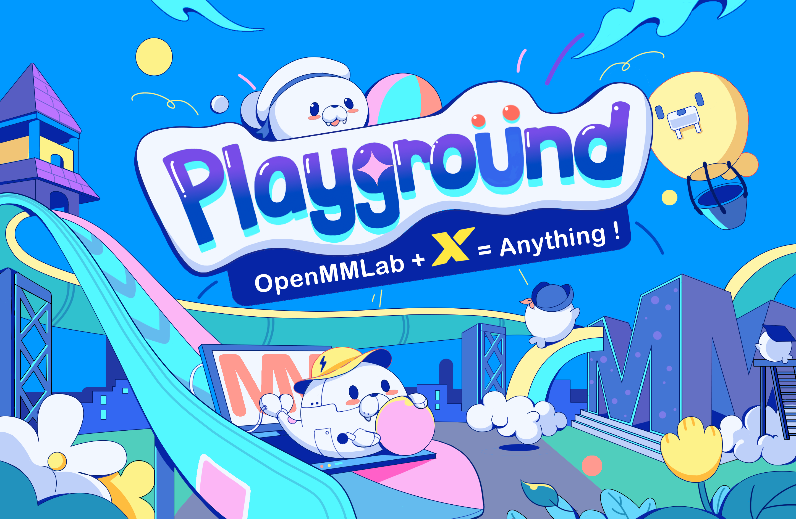

English | [简体中文](README_zh-CN.md)

🥳 🚀 **Welcome to  *OpenMMLab Playground* , an open-source initiative dedicated to gathering and showcasing amazing projects built with OpenMMLab. Our goal is to provide a central hub for the community to share their innovative solutions and explore the edge of AI technologies.**

🥳 🚀 **[OpenMMLab](https://github.com/open-mmlab) builds the most influential open-source computer vision algorithm system in the deep learning era, which provides high-performance and out-of-the-box algorithms for detection, segmentation, classification, pose estimation, video understanding, and AIGC. We believe that equipped with OpenMMLab, everyone can build exciting AI-empowered applications and push the limits of what's possible. All you need is a touch of creativity and a willingness to take action.**

🥳 🚀 **Join the  *OpenMMLab Playground*  now and enjoy the power of AI!**

 
  
  
  
  
  
  
  
  
  
  
  

 

______________________________________________________________________

# Project List

|                                              |                                                                     Demo                                                                     |                                                                                     Description                                                                                     |
| :------------------------------------------: | :------------------------------------------------------------------------------------------------------------------------------------------: | :---------------------------------------------------------------------------------------------------------------------------------------------------------------------------------: |
|           [MMDet-SAM](#-mmdet-sam)           |   | Explore a new way of instance segmentation by combining SAM (Segment Anything Model) with Closed-Set Object Detection, Open-Vocabulary Object Detection, Grounding Object Detection |
|        [MMRotate-SAM](#-mmrotate-sam)        |   |       Join SAM and weakly supervised horizontal box detection to achieve rotated box detection, and say goodbye to the tedious task of annotating rotated boxes from now on!        |
| [Open-Pose-Detection](#-open-pose-detection) |    |         Integrate open object detection and various pose estimation algorithms to achieve "Pose All Things" - the ability to estimate the pose of anything and everything!          |
|       [Open-Tracking](#-open-tracking)       |                                              |                                                Track and segment open categories in videos by marrying open object dtection and MOT.                                                |
|           [MMOCR-SAM](#-mmocr-sam)           |  |   A solution of Text Detection/Recognition + SAM that segments every text character, with striking text removal and text inpainting demos driven by diffusion models and Gradio!    |
|      [MMEditing-SAM](#-mmediting-sam)      |  |                                                  Join SAM and image generation to create awesome images and edit any part of them.                                                  |
| [Label-Studio-SAM](#-label-studio-sam) |  | Combining Label-Studio and SAM to achieve semi-automated annotation. |

# Gallery

## ✨ MMDet-SAM

We provide a set of applications based on MMDet and SAM. The features include:

1. Support all detection models (Closed-Set) included in MMDet, such as Faster R-CNN and DINO, by using SAM for automatic detection and instance segmentation annotation.
2. Support Open-Vocabulary detection models, such as Detic, by using SAM for automatic detection and instance segmentation annotation.
3. Support Grounding Object Detection models, such as Grounding DINO and GLIP, by using SAM for automatic detection and instance segmentation annotation.
4. All models support distributed detection and segmentation evaluation, and automatic COCO JSON export, making it easy for users to evaluate custom data.

Please see [README](mmdet_sam/README.md) for more information.

## ✨ MMRotate-SAM

We provide a set of applications based on MMRotate and SAM. The features include:

1. Support Zero-shot Oriented Object Detection with SAM.
2. Perform SAM-based Zero-shot Oriented Object Detection inference on a single image.

Please see [README](mmrotate_sam/README.md) for more information.

## ✨ Open-Pose-Detection

We provide a set of applications based on MMPose and open detection. The features include:

1. Support open detection and pose estimation model inference for a single image or a folder of images.
2. Will soon support inputting different text prompts to achieve pose detection for different object categories in an image.

Please see [README](mmpose_open_detection/README.md) for more information.

## ✨ Open-Tracking

We provide an approach based on open object detection and utilizing motion information (Kalman filter) for multi-object tracking.

Please see [README](mmtracking_open_detection/README.md) for more information.

## ✨ MMOCR-SAM

The project is migrated from [OCR-SAM](https://github.com/yeungchenwa/OCR-SAM), which combines MMOCR with Segment Anything. We provide a set of applications based on MMOCR and SAM. The features include:

1. Support End-to-End Text Detection and Recognition, with the ability to segment every text character.
2. Striking text removal and text inpainting WebUI demos driven by diffusion models and Gradio.

Please see [README](mmocr_sam/README.md) for more information.

## ✨ MMEditing-SAM

We provide a set of applications based on MMEditing and SAM. The features include:

1. Generate images with MMEditing interface.
2. Combine the masks generated by SAM with the image editing capabilities of MMEditing to create new pictures.

Please see [README](mmediting_sam/README.md) for more information.

## ✨ Label-Studio-SAM

The solution provides an integration of SAM with Label Studio. The specific features include:

1. Point2Label: Supports triggering SAM in Label-Studio to generate object masks and axis-aligned bounding box annotations by clicking a point within the object's area.
2. Bbox2Label: Supports triggering SAM in Label-Studio to generate object masks and axis-aligned bounding box annotations by annotating the object's bounding box.
3. Refine: Supports refining the annotations generated by SAM within Label-Studio.

详情见 [README](./label_anything/readme.md)。

