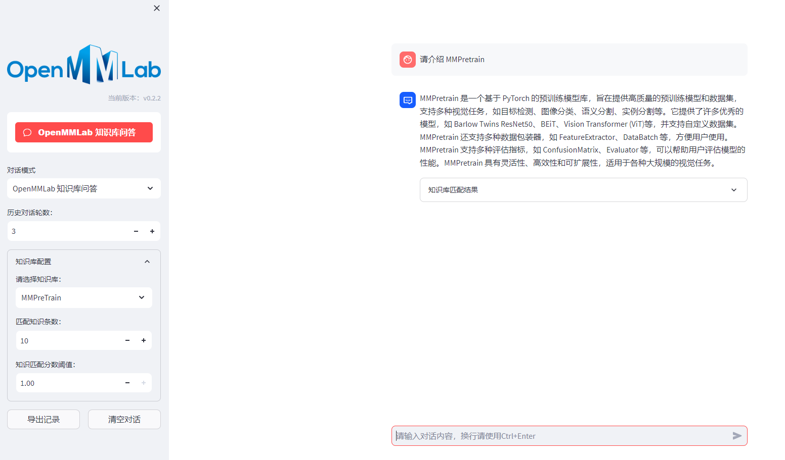

## 介绍

使用 [LangChain-Chatchat](https://github.com/chatchat-space/Langchain-Chatchat) 搭建基于 LLM [internlm/internlm-chat-7b-v1_1](https://huggingface.co/internlm/internlm-chat-7b-v1_1) 的 OpenMMLab 知识库问答。

 

## 模型支持

本项目中默认使用的 LLM 模型为 [internlm/internlm-chat-7b-v1_1](https://huggingface.co/internlm/internlm-chat-7b-v1_1)，默认使用的 Embedding 模型为 [moka-ai/m3e-base](https://huggingface.co/moka-ai/m3e-base) 。

设置文件 `configs/model_configs.py` 中的 `llm_model_dict` 为 `internlm-chat-7b`。

## 开发部署

### 软件需求

本项目已在 Python 3.8，CUDA 11.7 Ubuntu 环境下完成测试。

### 1. 开发环境准备

参见 [开发环境准备](docs/INSTALL.md)。

### 2. 下载模型至本地

下载 LLM 模型 [internlm/internlm-chat-7b-v1_1](https://huggingface.co/internlm/internlm-chat-7b-v1_1) 与 Embedding 模型 [moka-ai/m3e-base](https://huggingface.co/moka-ai/m3e-base) 为例：

下载模型需要先[安装Git LFS](https://docs.github.com/zh/repositories/working-with-files/managing-large-files/installing-git-large-file-storage)，然后运行

```Shell
$ git clone https://huggingface.co/internlm/internlm-chat-7b-v1_1

$ git clone https://huggingface.co/moka-ai/m3e-base
```

### 3. 设置配置项

在开始执行 Web UI 或命令行交互前，请先检查 `configs/model_config.py` 和 `configs/server_config.py` 中的各项模型参数设计是否符合需求：

- 请确认已下载至本地的 LLM 模型本地存储路径写在 `llm_model_dict` 对应模型的 `local_model_path` 属性中，如:

```python
llm_model_dict={
                "internlm-chat-7b": {
                        "local_model_path": "/root/huggingface/internlm-chat-7b-v1_1",
                        "api_base_url": "http://localhost:8888/v1",  # "name"修改为 FastChat 服务中的"api_base_url"
                        "api_key": "EMPTY"
                    },
                }
```

- 请确认已下载至本地的 Embedding 模型本地存储路径写在 `embedding_model_dict` 对应模型位置，如：

```python
embedding_model_dict = {
                        "m3e-base": "/root/huggingface/m3e-base",
                       }
```

### 5. 启动 API 服务或 Web UI

#### 5.1 启动 LLM 服务

如需使用开源模型进行本地部署，需首先启动 LLM 服务

在项目根目录下，执行 [server/llm_api.py](server/llm_api.py) 脚本启动 **LLM 模型**服务：

```shell
$ python server/llm_api.py
```

项目支持多卡加载，需在 llm_api.py 中修改 create_model_worker_app 函数中，修改如下三个参数:

```python
gpus=None, 
num_gpus=1, 
max_gpu_memory="20GiB"
```

其中，`gpus` 控制使用的显卡的ID，如果 "0,1";

`num_gpus` 控制使用的卡数;

`max_gpu_memory` 控制每个卡使用的显存容量。

#### 5.2 启动 API 服务

本地部署情况下，按照 [5.1 节](README.md#5.1-启动-LLM-服务)**启动 LLM 服务后**，再执行 [server/api.py](server/api.py) 脚本启动 **API** 服务；

在线调用API服务的情况下，直接执执行 [server/api.py](server/api.py) 脚本启动 **API** 服务；

调用命令示例：

```shell
$ python server/api.py
```

启动 API 服务后，可访问 `localhost:7861` 或 `{API 所在服务器 IP}:7861` FastAPI 自动生成的 docs 进行接口查看与测试。


#### 5.3 启动 Web UI 服务

按照 [5.2 节](README.md#5.2-启动-API-服务)**启动 API 服务后**，执行 [webui.py](webui.py) 启动 **Web UI** 服务（默认使用端口 `8501`）

```shell
$ streamlit run webui.py
```

使用 Langchain-Chatchat 主题色启动 **Web UI** 服务（默认使用端口 `8501`）

```shell
$ streamlit run webui.py --theme.base "light" --theme.primaryColor "#165dff" --theme.secondaryBackgroundColor "#f5f5f5" --theme.textColor "#000000"
```

或使用以下命令指定启动 **Web UI** 服务并指定端口号

```shell
$ streamlit run webui.py --server.port 666
```

- Web UI 对话界面：
  
  

---

### 6. 一键启动

更新一键启动脚本 startup.py,一键启动所有 Fastchat 服务、API 服务、WebUI 服务，示例代码：

```shell
$ python startup.py -a
```

并可使用 `Ctrl + C` 直接关闭所有运行服务。如果一次结束不了，可以多按几次。

可选参数包括 `-a (或--all-webui)`, `--all-api`, `--llm-api`, `-c (或--controller)`, `--openai-api`,
`-m (或--model-worker)`, `--api`, `--webui`，其中：

- `--all-webui` 为一键启动 WebUI 所有依赖服务；
- `--all-api` 为一键启动 API 所有依赖服务；
- `--llm-api` 为一键启动 Fastchat 所有依赖的 LLM 服务；
- `--openai-api` 为仅启动 FastChat 的 controller 和 openai-api-server 服务；
- 其他为单独服务启动选项。

若想指定非默认模型，需要用 `--model-name` 选项，示例：

```shell
$ python startup.py --all-webui --model-name Qwen-7B-Chat
```

更多信息可通过 `python startup.py -h`查看。

**注意：**

**1. startup 脚本用多进程方式启动各模块的服务，可能会导致打印顺序问题，请等待全部服务发起后再调用，并根据默认或指定端口调用服务（默认 LLM API 服务端口：`127.0.0.1:8888`,默认 API 服务端口：`127.0.0.1:7861`,默认 WebUI 服务端口：`本机IP：8501`)**

**2.服务启动时间示设备不同而不同，约 3-10 分钟，如长时间没有启动请前往 `./logs`目录下监控日志，定位问题。**

**3. 在Linux上使用ctrl+C退出可能会由于linux的多进程机制导致multiprocessing遗留孤儿进程，可通过shutdown_all.sh进行退出**

